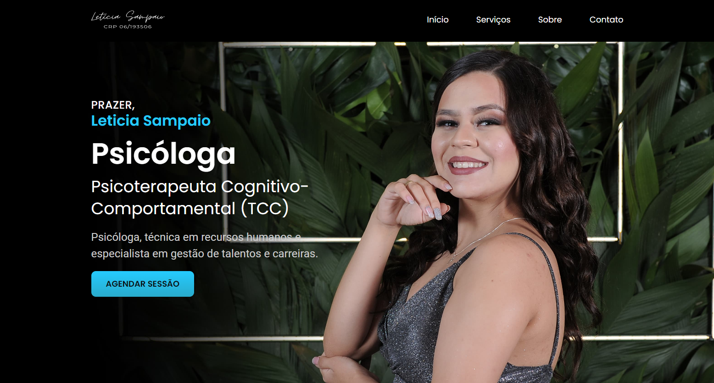
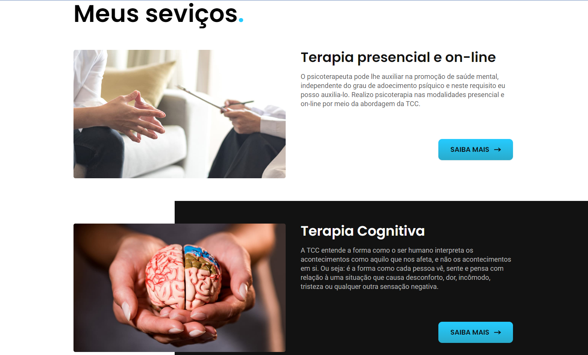
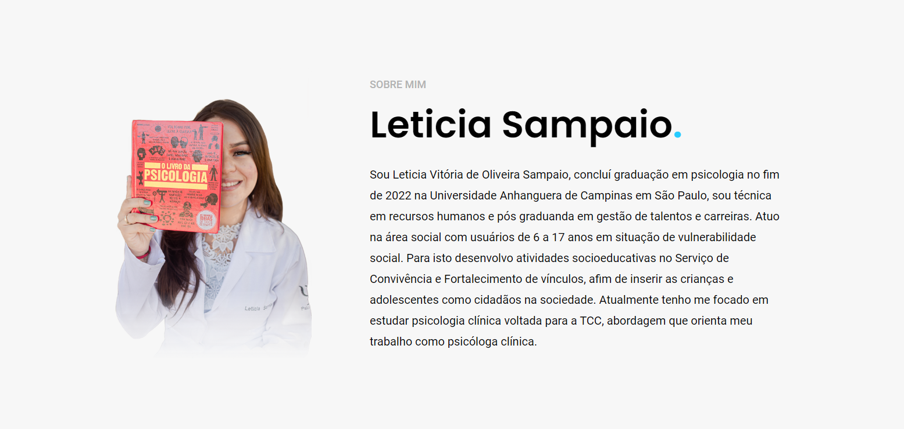
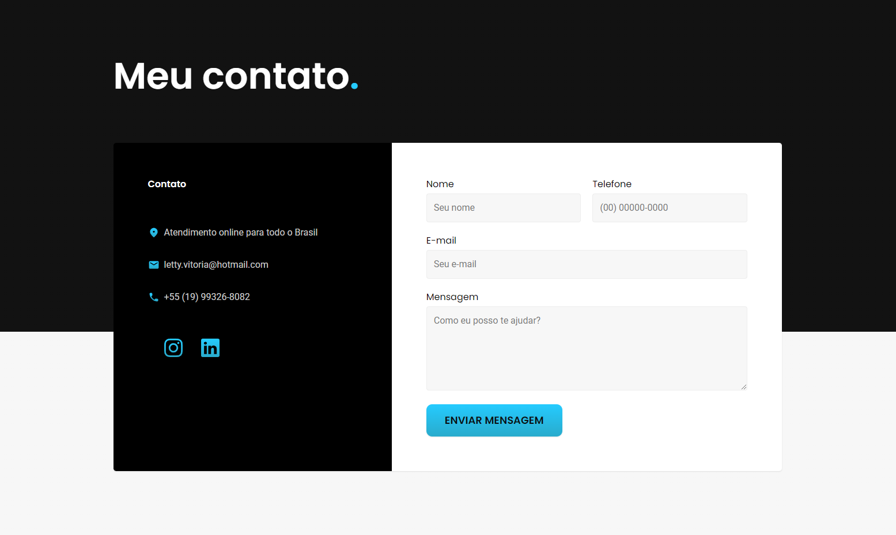

# Landing Page | Psicóloga Leticia Sampaio

Projeto desenvolvido desde o UI/UX Design até a produção e manutenção.

## Tecnologias e Ferramentas Utilizadas:

## Contribuições

Toda contribuição é bem vinda! Tem sugestões ou melhorias? Fiquei à vontade para abrir issues e enviar pull requests.

## Seções

### Introdução

<h1 align="center">
    
</h1>

### Serviços

<h1 align="center">
    
</h1>

### Sobre

<h1 align="center">
    
</h1>

### Contato

<h1 align="center">
    
</h1>
